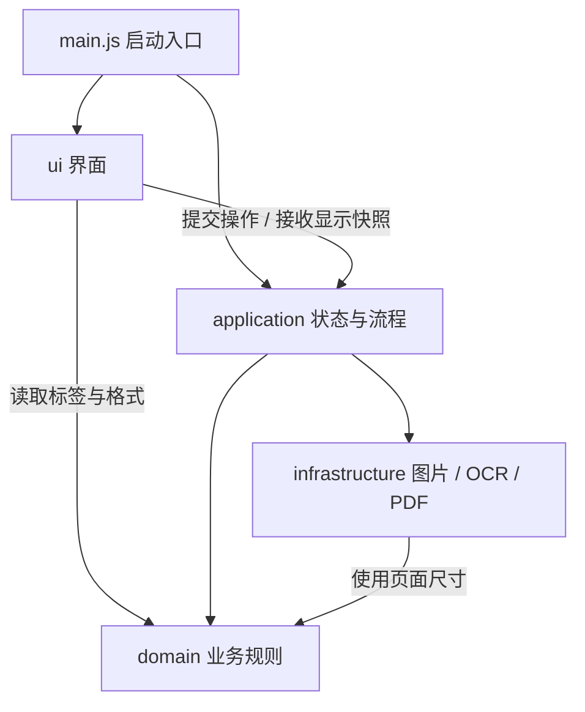

# 三图票据整理

选择一张发票、一张淘宝订单/付款截图和一张微信/支付宝支付截图，自动识别类型、预览排版并导出 A4 PDF。页面显示淘宝实付款，可修改；PDF 只保留三张图片。支持电脑和手机浏览器。

## 使用

1. 一次选择三张 JPG/PNG，顺序不限，每张不超过 20 MB。
2. 等待本地识别，核对图片类型和淘宝实付款。识别不明确时选择类型或填写金额。
3. 查看预览、填写文件名，点击“导出 PDF”。长发票会另页排版。

“添加到桌面”使用浏览器的安装功能；没有弹出安装窗口时，可从浏览器菜单安装应用或添加到主屏幕。首次使用需联网加载程序和识别模型，页面显示“离线资源已就绪”后，可以离线重新打开、识别和导出。浏览器清理缓存后需要重新加载。手机 OCR 性能需实机验证。

图片、OCR 文本和金额只在当前页面内存中处理，没有上传接口、云端识别或账本存储。离线缓存只包含程序和模型。金额识别结果仍需对照截图核对；淘宝实付款优先于支付账单，两个金额不同会提示。

## 本地开发和启动

需要 Node.js 22.12+ 或 24+，在本目录执行：

```powershell
npm install
npm run dev
npm test
npm run build
npm run preview
```

已安装依赖并构建后，可以双击 `启动票据工具.cmd`。窗口保持打开即可使用；关闭窗口停止本地服务。电脑 localhost 支持离线缓存，手机独立安装需要可访问的 HTTPS 静态站点。

## 代码分层与扩展

| 模块 | 职责 |
| --- | --- |
| `src/main.js` | 启动入口，连接流程层和界面层 |
| `src/ui/receipt-view.js` / `style.css` | 界面层：收集操作、显示状态、绘制预览、浏览器下载与安装 |
| `src/application/receipt-service.js` | 流程层：持有当前票据状态，统一选图、识别、纠正类型和金额、生成导出结果、释放资源 |
| `src/domain/rules.js` | 规则层：纯函数，负责分类、金额判断、核对、图片角色约束和排版；不访问浏览器或第三方库 |
| `src/infrastructure/images.js` / `ocr.js` / `pdf.js` | 能力层：封装浏览器图片读取、Tesseract.js 和 pdf-lib |

界面通过 `selectFiles`、`setRole`、`setRoles`、`setAmount`、`exportPdf` 提交操作，流程层通过回调提供显示快照。界面拿到的角色和排版数据是副本，不能直接修改流程层保存的业务记录。图片字节、对象 URL 和浏览器图像对象保存在独立的资源集合，业务记录只保留普通数据。



依赖约束：界面不导入能力层；流程层不操作页面；规则层不依赖其他层；第三方库仅由能力层调用。小型测试会检查静态模块导入的方向。浏览器下载只负责保存流程层返回的 PDF 字节，PDF 排版和文件名处理不在界面中。

以后调整样式或交互，改 `ui`；增加处理步骤或状态，改 `application`；调整分类、金额或分页，改 `domain`；替换识别或 PDF 库，改 `infrastructure`。当前没有数据保存需求，因此没有数据库层；需要保存历史票据时再加入存储能力。

预览画布和 PDF 使用相同的布局数据，坐标以 PDF 点数保存，金额以整数“分”保存。整页文字只识别一次，全文和行坐标共用于分类与金额定位；定位后以英文数字模式读取付款数字的小区域。使用 Vite 构建；Tesseract.js 及中英文模型、pdf-lib 均固定版本，模型和运行时在构建时复制到静态站点。

`test/rules.test.js` 覆盖层间依赖方向、图片分类、商品“实付价”与订单“实付款”的区分、优惠金额、账单日期、金额歧义、手工金额核对和分页。`npm run build` 生成 `dist` 及内容版本化的离线缓存。部署只使用 `dist`；现有票据、测试截图、诊断结果和 `output` 不包含在站点中。

## 已验证

2026-09-30：八组现有票据共 24 张，在 Edge 浏览器按乱序选入，分类和淘宝实付款均与原图核对一致。七组导出一页，长发票“元器件03”导出两页。逐页检查了 A4 边界、原比例和完整原图；PDF 未增加文字。

已检查桌面和 390 px 手机视口、手动类型纠正、金额差异提示、无效金额及错误选图保留原组。断网重新打开后，用 JPG/PNG 混合选图完成识别、预览和 PDF 下载。未连接实体手机，手机 OCR 速度、系统文件选择器和桌面安装仍需实机检查。当前测试 Edge 未提供 WebMCP，界面纠正功能已通过验证。

同日分层整理后重新验证了八组原图、类型与金额纠正、金额校验、错误选图保留原组和断网 JPG/PNG 导出。九份导出 PDF 的图片内容及所有放置坐标与整理前一致，浏览器未出现页面错误。五项小型测试和生产构建通过。
