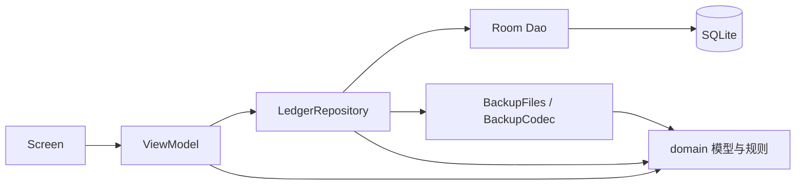

# 安卓记账架构

采用单 Activity、Navigation Compose、MVVM 和单向数据流。保留一个 Gradle `app` 模块，按职责与页面分包。

## 目录与职责

```text
com.localledger.app/
├─ LedgerApplication.kt           组装 Database、Repository、BackupFiles
├─ MainActivity.kt                Activity 生命周期、系统文件选择器、根界面
├─ domain/
│  ├─ LedgerModels.kt             业务模型、列表项、汇总、完整账本快照
│  ├─ MoneyDates.kt               整数金额解析、展示、本地月份边界
│  ├─ Asset.kt / AppUpdate.kt      物品、整数均价规则、更新信息模型
│  ├─ Memo.kt / Planning.kt        备忘录、月预算、固定账目和月末推进
│  ├─ Wish.kt                      心愿、预计价格、已攒金额与剩余目标
│  ├─ ReportModels.kt / ImportModels.kt  筛选与报表、导入预览模型
│  └─ LedgerValidation.kt         快照 ID、金额、时间、引用及总额校验
├─ data/
│  ├─ db/                        Entity、Dao、Database、查询行、实体映射
│  ├─ repository/                账本、物品、备忘录、心愿、规划、设置、导入、更新 Repository
│  ├─ backup/                    JSON 编解码、ContentResolver 文件读写
│  └─ update/                    更新信息解析、JobService 定时检查入口
│     importing/ / reminder/     有界 CSV 解析、固定账目通知入口
└─ ui/
   ├─ LedgerApp.kt               主题、导航、页面 ViewModel 创建
   ├─ home/                      HomeScreen、HomeViewModel 与 HomeState
   ├─ add/                       EntryScreen、EntryViewModel 与草稿状态
   ├─ stats/                     StatsScreen、StatsViewModel 与统计状态
   ├─ category/                  CategoryScreen、CategoryViewModel 与状态
   ├─ assets/                    物品列表与编辑页、各自的 ViewModel
   ├─ update/                    更新弹窗与 ViewModel
   ├─ memo/ / planning/ / settings/ / importing/  备忘录、规划、总设置、CSV 预览
   ├─ wishes/                    心愿清单、进度、编辑页与 ViewModel
   ├─ backup/                    LedgerHostViewModel：初始化、恢复确认状态
   └─ common/                    共用组件、错误展示转换
```

状态类与对应 ViewModel 放在同一文件，避免散落的小文件。新增和编辑继续共用一个记账页面。

## 边界

- 页面通过 ViewModel 方法提交操作，用 `collectAsStateWithLifecycle` 观察状态；不能修改 ViewModel 的内部可变 Flow。
- ViewModel 只调用 Repository，使用 domain 模型；不访问 Dao、Room Entity、SharedPreferences 或文件读写实现。
- Repository 将 Entity 转为 domain 模型再返回；恢复时反向转换。聚合结果本身是无 Room 注解的简单 domain 数据类，由 Dao 直接构造。
- `domain` 不依赖 `data`、`ui`、Android、Room 或 JSON 库。金额、月份、快照完整性规则可以在 JVM 上测试。
- 依赖当前数据库状态的规则保留在 Repository 的事务中，例如分类停用、分类类型、金额总和。不能把“先检查、后写入”拆成两个独立操作。
- `data/backup` 处理 JSON 字段类型与文件大小边界，再调用 domain 完整性校验。Repository 负责导出一致快照和事务恢复；确认是否覆盖由 UI 决定。
- Application 是依赖装配入口。Activity 取得系统文件 URI 后交给 ViewModel，自己不操作账本。



数据库当前为版本 4，共八张表，使用 1→2→3→4 自动迁移旧数据。JSON 格式版本 4 备份全部业务表，兼容读取版本 1、2、3。物品均价使用整数运算，所有有效物品总估值限制为 Long 范围；规则在保存事务及恢复前统一校验。

心愿独立记录预计价格与用户填写的已攒金额，不修改账目或支付账户。每个心愿先将有效攒钱限制在其目标以内，再汇总待买预算和剩余目标；买到／软删除项不计入待买预算。保存与恢复均检查整数总额，避免溢出。达成和编辑保留 UUID、创建时间与历史状态。

备忘录和记账使用各自的 NavController 与导航图，仅共用顶部切换、外观和完整备份能力。备忘录图不包含账单、资产、报表、分类或预算页面；系统快捷入口先切换模式，再进入对应表单。当前模式使用保存状态，默认主页仅决定新的启动会话；1.4.0 的一次性偏好迁移设为备忘录，以后尊重用户选择。

预算独立存储每月总额度；固定账目关联分类和账户，确认时在一次 Room 事务中校验预期到期日、复用账本保存并推进月份，避免重复处理。CSV 经严格解析、关联映射及重复预览后事务入账，导入键唯一索引与备份同步保留。设置保存于本机 SharedPreferences，根界面订阅外观与金额隐藏，系统权限由 Activity 请求。备忘录保留 UUID 和软删除。

应用更新独立于本机业务数据：`UpdateViewModel → UpdateRepository → HTTPS/PackageManager`。原生 `JobService` 同样调用该 Repository 检查新版本；Activity 只负责系统权限、FileProvider 和安装器。1.4.0 首次打开启用已预置的 GitHub 更新源和自动检查，并请求所需通知权限；后续保留手动开关。开启后系统每日调度，不保证精确时间，下载与安装由用户确认。更新不上传本机业务数据。

## 扩展方式

新增页面放入对应 `ui/<功能>`，配套 ViewModel 和状态；数据操作先经过 Repository，再落到 Dao 或备份实现。表结构变化必须增加数据库版本并提供迁移；备份内容变化也要处理旧格式读取。

当前没有复杂的跨 Repository 编排，因此不增加空转的 UseCase、BaseRepository 或 DI 框架。只有出现多页面复用的复杂业务操作，再提取 UseCase；出现实际构建隔离需求，再拆 Gradle 模块。

参考 [Android 官方分层建议](https://developer.android.com/topic/architecture/recommendations) 和 [Ivy Wallet 架构说明](https://github.com/Ivy-Apps/ivy-wallet/blob/main/docs/guidelines/Architecture.md)：数据统一由 Repository 提供，ViewModel 转成界面状态，领域用例按业务复杂度引入。
